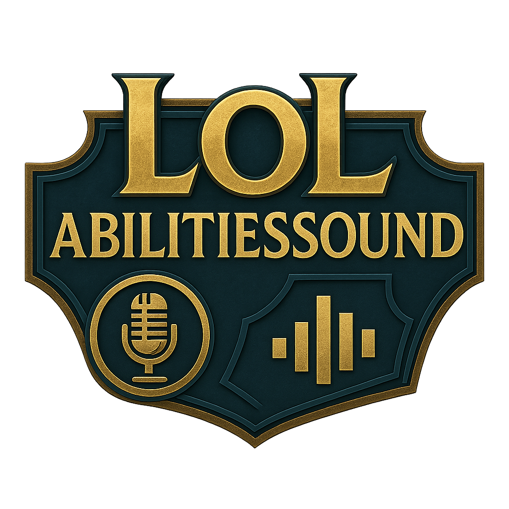

# LOL Abilities Sound

<div align="center">



**Программа для проигрывания пользовательских звуков в Discord при использовании способностей в League of Legends**

[](https://dotnet.microsoft.com/download/dotnet/8.0)
[](https://www.microsoft.com/windows)
[](LICENSE)
[](https://docs.microsoft.com/en-us/dotnet/csharp/)

</div>

## Описание

LOL Abilities Sound - это программа, которая позволяет воспроизводить пользовательские звуки в голосовом чате Discord при использовании способностей персонажей в League of Legends. Программа автоматически определяет, когда вы находитесь в игре, отслеживает нажатие клавиш способностей (Q, W, E, R) и воспроизводит назначенные звуки как в Discord, так и локально.

## Основные возможности

### Управление звуками
- **Индивидуальные звуки для каждой способности** - настройте уникальные звуки для Q, W, E, R каждого чемпиона
- **Поддержка популярных аудиоформатов** - MP3, WAV, OGG
- **Регулировка громкости** - отдельные настройки для Discord и локального воспроизведения
- **Задержка воспроизведения после использования** - настраиваемая задержка воиспроизведения звука одного и того же умения во избежание спама

### Интеграция с League of Legends
- **Автоматическое обнаружение игры** - программа сама определяет, запущена ли League of Legends
- **Определение текущего чемпиона** - автоматически загружает конфигурацию звуков для выбранного персонажа
- **Интеграция с LCU API** - использует официальный API клиента League of Legends
- **Загрузка изображений чемпионов** - отображает портреты и иконки способностей прямо из игровых файлов

### Аудиосистема
- **Поддержка VB-Audio Virtual Cable** - для передачи звука в Discord
- **Выбор микрофона** - возможность выбора устройства записи
- **Микширование звука** - одновременное воспроизведение нескольких звуков
- **Высококачественное аудио** - поддержка 48kHz, стерео

### Удобный интерфейс
- **Современный WPF интерфейс** - красивый и интуитивный дизайн
- **Поиск чемпионов** - быстрый поиск нужного персонажа
- **Сворачиваемые списки** - компактное отображение информации

## Установка и настройка

### Системные требования
- **Операционная система**: Windows 10/11
- **.NET**: 8.0 или выше
- **League of Legends**: установленная игра
- **VB-Audio Virtual Cable**: для передачи звука в Discord

### Пошаговая установка

1. **Скачайте и установите VB-Audio Virtual Cable**
   ```
   https://vb-audio.com/Cable/
   ```

2. **Настройте Discord**
   - Откройте настройки Discord
   - Перейдите в "Голос и видео"
   - Выберите "CABLE Output (VB-Audio Virtual Cable)" как устройство ввода

3. **Запустите LOL Abilities Sound**
   - Скачайте последнюю версию из релизов
   - Распакуйте архив
   - Запустите `LOL abilities sound.exe`

4. **Настройте программу**
   - Перейдите в настройки
   - Выберите ваш микрофон
   - Настройте громкость звуков

## Использование

### Настройка звуков способностей

1. **Запустите программу** и League of Legends
2. **Перейдите на страницу "Настройка звуков способностей"**
3. **Найдите нужного чемпиона** через поиск или прокрутку
4. **Кликните на поле звука** для способности (Q, W, E, R)
5. **Выберите аудиофайл** в открывшемся диалоге
6. **Настройте задержку** если необходимо
7. **Сохраните настройки** кнопкой с иконкой дискеты

### Игровой процесс

1. **Включите программу** переключателем на главной странице
2. **Зайдите в игру** - программа автоматически определит вашего чемпиона
3. **Используйте способности** - звуки будут воспроизводиться автоматически
4. **Наслаждайтесь реакцией** команды в Discord! ??

## Настройки

### Аудио настройки
- **Громкость в Discord** - регулирует громкость звуков, передаваемых в голосовой чат
- **Локальная громкость** - регулирует громкость звуков для вас лично
- **Выбор микрофона** - выбор устройства записи для передачи в Discord

### Настройки способностей
- **Звуковой файл** - путь к аудиофайлу для способности
- **Задержка** - время в секундах перед воспроизведением звука
- **Удаление звука** - кнопка для удаления назначенного звука

## Архитектура проекта

### Основные компоненты

- **MainWindow.cs** - главное окно приложения, обработка глобальных клавиш
- **VoiceProcessor.cs** - обработка аудио, микширование звуков
- **LcuApi.cs** - интеграция с League of Legends Client API
- **Config.cs** - управление конфигурацией и настройками
- **Pages/** - страницы интерфейса (главная, настройки, звуки способностей)

### Используемые технологии

- **WPF** - пользовательский интерфейс
- **NAudio** - обработка аудио
- **LeagueToolkit** - работа с файлами League of Legends
- **MouseKeyHook** - глобальные горячие клавиши
- **Newtonsoft.Json** - сериализация конфигурации

## Принцип работы

1. **Обнаружение игры** - программа постоянно проверяет наличие процесса League of Legends
2. **Подключение к LCU API** - устанавливается соединение с клиентом игры
3. **Определение чемпиона** - получение информации о текущем персонаже
4. **Отслеживание клавиш** - глобальные хуки отслеживают нажатия Q, W, E, R
5. **Воспроизведение звука** - при нажатии клавиши воспроизводится соответствующий звук
6. **Передача в Discord** - звук микшируется и передается через VB-Cable

## Особенности интерфейса

- **Адаптивный дизайн** - интерфейс подстраивается под размер окна
- **Иконки способностей** - Q, W, E, R иконки для визуального представления
- **Предварительная загрузка** - изображения и иконки кэшируются для быстрого доступа
- **Прогрессивная загрузка** - чемпионы загружаются батчами для оптимизации производительности
- **Поиск в реальном времени** - мгновенная фильтрация списка чемпионов

## Безопасность

- **Только чтение данных** - программа не изменяет файлы League of Legends
- **Локальные настройки** - вся конфигурация хранится локально
- **Официальный API** - использует только официальные интерфейсы Riot Games

## Вклад в проект

Мы приветствуем вклад в развитие проекта! Если у вас есть идеи, предложения или вы нашли баги:

1. Создайте Issue для обсуждения изменений
2. Сделайте Fork репозитория
3. Создайте ветку для ваших изменений
4. Отправьте Pull Request

## Планы развития

- [ ] Поддержка множества звуков на одно умение (рандом)
- [ ] Встроенная библиотека звуков
- [ ] Интеграция с Twitch для стримеров

## ? Часто задаваемые вопросы

### Q: Программа не видит League of Legends
A: Убедитесь, что игра запущена и авторизована. Попробуйте перезапустить программу.

### Q: Звуки не передаются в Discord
A: Проверьте, что VB-Audio Virtual Cable установлен и выбран в настройках Discord как устройство ввода.

### Q: Программа влияет на производительность игры?
A: Нет, программа использует минимальные ресурсы и не влияет на FPS в игре.

## Поддержка

Если у вас возникли проблемы или вопросы:
- Создайте Issue в GitHub репозитории
- Опишите проблему максимально подробно
- Приложите логи из папки программы

## Лицензия

Этот проект распространяется под лицензией MIT. Подробности в файле [LICENSE](LICENSE).

---

<div align="center">

**Сделано с любовью для сообщества League of Legends**

</div>
